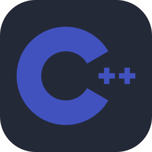

## Hi there 👋

## 🛠️ Skills

<table>
  <tr>
    <td align="center"><h3>Lenguajes Programación</h3></td>
    <td align="center"><h3>Sistemas Operativos</h3></td>
  </tr>
  <tr>
    <td align="center">
      
      
      
      
      
      
      
      
    </td>
    <td align="center">
      
      
      
    </td>
  </tr>
  <tr>
    <td align="center" colspan=2>
      <h3>Networking</h3>
    </td>
  </tr>
</table>

